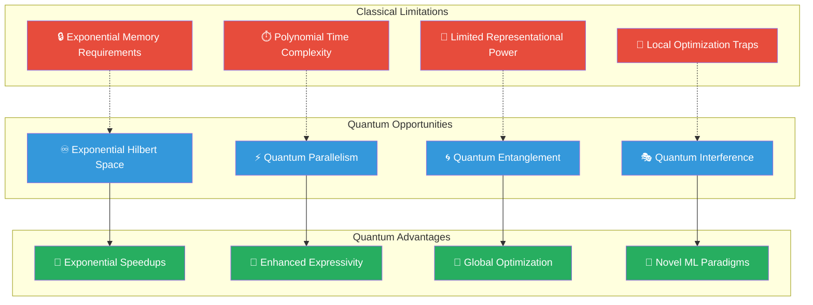
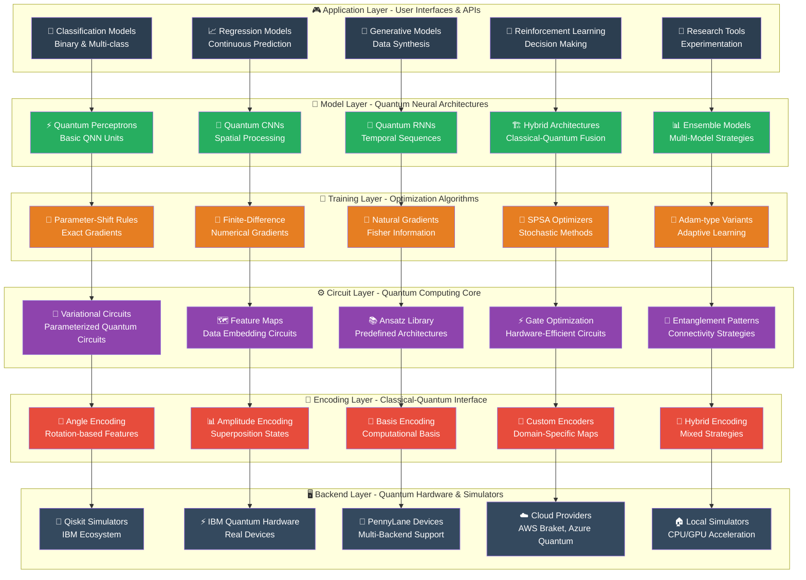
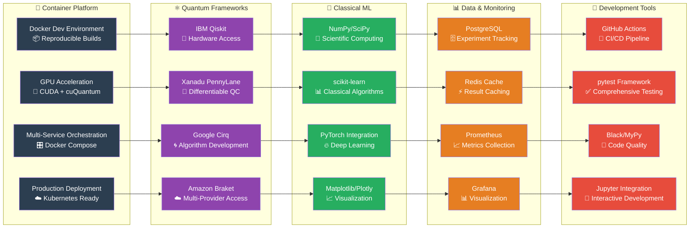
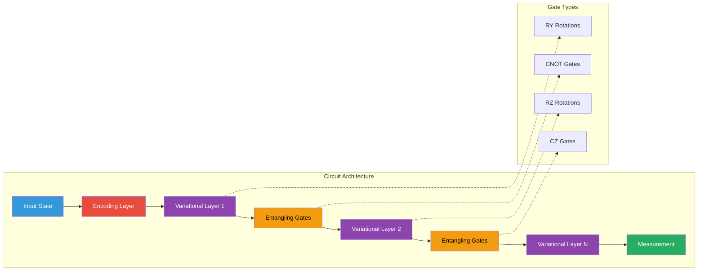
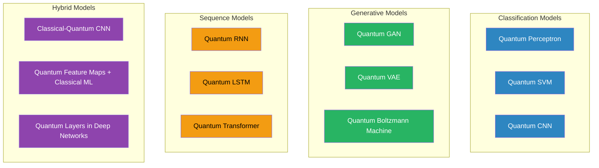
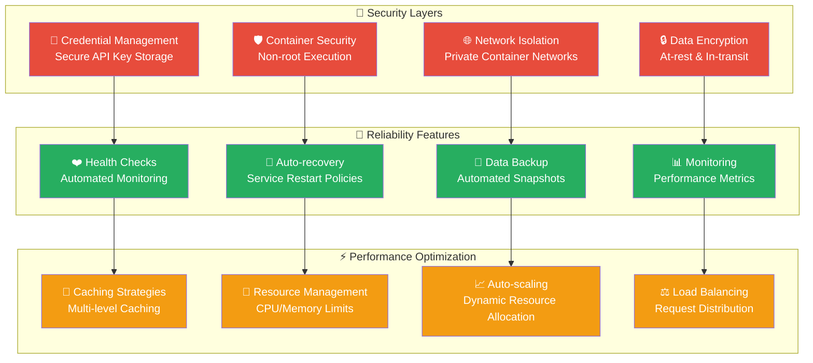
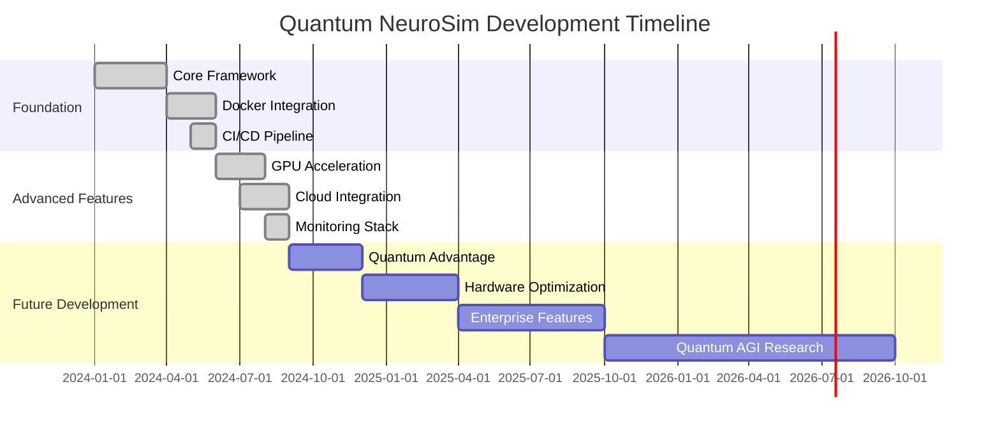

# Quantum NeuroSim 🧠⚛️

<div align="center">

**A comprehensive framework for quantum neural networks and hybrid quantum-classical machine learning**

[](https://opensource.org/licenses/MIT)
[](https://www.python.org/downloads/)
[](https://qiskit.org/)
[](https://pennylane.ai/)
[](https://docker.com/)
[](https://github.com/features/actions)

🚀 **Production-Ready** | 🐳 **Containerized** | ☁️ **Cloud-Native** | 📊 **Monitored**

</div>

---

## 🌟 **Revolutionary Quantum Machine Learning Platform**

Quantum NeuroSim represents the next frontier in artificial intelligence, seamlessly bridging quantum computing and neural networks to unlock computational capabilities impossible with classical systems alone. Built for researchers, developers, and enterprises seeking quantum advantage in machine learning.

## 🎯 **Project Purpose & Vision**

**Quantum NeuroSim** revolutionizes machine learning by harnessing quantum mechanical phenomena to solve problems beyond the reach of classical computers. Our framework serves as the bridge between theoretical quantum computing and practical AI applications, enabling breakthrough discoveries in quantum-enhanced intelligence.

### 🚀 **Core Mission**

| Objective | Description | Impact |
|-----------|-------------|---------|
| **🔬 Quantum Advantage Discovery** | Identify and demonstrate computational problems where quantum methods outperform classical approaches | Unlock new classes of solvable ML problems |
| **🧠 Neural Network Innovation** | Develop novel quantum neural architectures leveraging superposition, entanglement, and interference | Create more expressive and efficient models |
| **🏭 Enterprise Applications** | Bridge quantum research to real-world business problems in optimization, simulation, and AI | Enable quantum-powered competitive advantages |
| **🎓 Educational Ecosystem** | Provide accessible tools for learning and teaching quantum machine learning concepts | Accelerate quantum literacy and adoption |
| **🌐 Community Building** | Foster collaboration between quantum physicists, ML researchers, and software engineers | Advance the entire field through open science |

### 🌌 **Why Quantum Neural Networks Matter**

Classical neural networks, despite their remarkable success, face fundamental computational and theoretical limitations that quantum systems can potentially overcome:



### 🔬 **Quantum Mechanical Advantages in ML**

#### **1. Superposition: Parallel Processing**
- **Classical**: Process one input state at a time
- **Quantum**: Process exponentially many states simultaneously
- **ML Benefit**: Massive parallelization of feature exploration

#### **2. Entanglement: Non-local Correlations**
- **Classical**: Limited to pairwise feature interactions
- **Quantum**: Complex multi-body correlations across all features
- **ML Benefit**: Capture intricate patterns impossible classically

#### **3. Interference: Amplitude Manipulation**
- **Classical**: Probability-based information processing
- **Quantum**: Amplitude-based computation with constructive/destructive interference
- **ML Benefit**: Enhanced pattern recognition and optimization landscapes

#### **4. Exponential State Space**
- **Classical**: Linear scaling with system size
- **Quantum**: Exponential state space with polynomial resources
- **ML Benefit**: Access to vastly larger model capacities

# ⚛️ Quantum Libraries Overview

Quantum NeuroSim leverages the most advanced Python quantum computing libraries, each with unique strengths for simulation, hardware access, and hybrid quantum-classical workflows. Below is a rundown of the core libraries used, with links, descriptions, and example usage. See the [examples/](examples/) directory for full scripts.

| Library | Description | Official Link | Example |
|---------|-------------|--------------|---------|
| **Qiskit** | IBM's open-source SDK for working with quantum computers at the circuit and algorithm level. | [qiskit.org](https://qiskit.org/) | [examples/qiskit_example.py](examples/qiskit_example.py) |
| **PennyLane** | Hybrid quantum-classical ML and differentiable programming, hardware-agnostic. | [pennylane.ai](https://pennylane.ai/) | [examples/pennylane_example.py](examples/pennylane_example.py) |
| **Cirq** | Google's framework for designing, simulating, and running quantum circuits, with a focus on NISQ devices. | [quantumai.google/cirq](https://quantumai.google/cirq) | [examples/cirq_example.py](examples/cirq_example.py) |
| **Amazon Braket SDK** | AWS's SDK for running quantum jobs on multiple cloud hardware providers. | [aws.amazon.com/braket](https://aws.amazon.com/braket/) | [examples/braket_example.py](examples/braket_example.py) |

### Qiskit Example: Create and Simulate a Bell State

```python
from qiskit import QuantumCircuit, Aer, execute

# Create a 2-qubit Bell state circuit
circuit = QuantumCircuit(2, 2)
circuit.h(0)           # Hadamard on qubit 0
circuit.cx(0, 1)       # CNOT from qubit 0 to 1
circuit.measure([0, 1], [0, 1])

# Simulate using the QasmSimulator
simulator = Aer.get_backend('qasm_simulator')
result = execute(circuit, simulator, shots=1024).result()
counts = result.get_counts()
print("Bell state counts:", counts)
```

See: [examples/qiskit_example.py](examples/qiskit_example.py)

### PennyLane Example: Quantum Circuit as a Differentiable Function

```python
import pennylane as qml
import numpy as np

dev = qml.device('default.qubit', wires=2)

@qml.qnode(dev)
def bell_circuit(theta):
    qml.Hadamard(wires=0)
    qml.CNOT(wires=[0, 1])
    qml.RY(theta, wires=0)
    return qml.expval(qml.PauliZ(0))

theta = np.pi / 4
result = bell_circuit(theta)
print("Expectation value:", result)
```

See: [examples/pennylane_example.py](examples/pennylane_example.py)

### Cirq Example: Simulate a Quantum Circuit

```python
import cirq

# Create two qubits
q0, q1 = cirq.LineQubit.range(2)
circuit = cirq.Circuit(
    cirq.H(q0),
    cirq.CNOT(q0, q1),
    cirq.measure(q0, q1, key='result')
)

simulator = cirq.Simulator()
result = simulator.run(circuit, repetitions=1000)
print("Measurement results:", result.histogram(key='result'))
```

See: [examples/cirq_example.py](examples/cirq_example.py)

### Amazon Braket Example: Run a Circuit on a Local Simulator

```python
from braket.circuits import Circuit
from braket.devices import LocalSimulator

circuit = Circuit().h(0).cnot(0, 1).measure(0, 1)
device = LocalSimulator()
result = device.run(circuit, shots=1000).result()
print("Measurement counts:", result.measurement_counts)
```

See: [examples/braket_example.py](examples/braket_example.py)

## 🏗️ **Comprehensive System Architecture**

Quantum NeuroSim implements a sophisticated, modular architecture that seamlessly integrates quantum computing, classical machine learning, and modern software engineering practices. Our design philosophy emphasizes scalability, maintainability, and quantum-classical hybrid optimization.

### 🎯 **High-Level System Overview**



### 🔧 **Technology Integration Architecture**

Our framework integrates cutting-edge technologies from quantum computing, classical ML, and modern DevOps practices:



### 📊 Data Flow Architecture

```mermaid
flowchart LR
    subgraph "Data Preprocessing"
        D1[Classical Data]
        D2[Normalization]
        D3[Validation]
        D4[Augmentation]
    end

    subgraph "Quantum Encoding"
        Q1[Angle Encoding]
        Q2[Amplitude Encoding]
        Q3[Feature Maps]
    end

    subgraph "Quantum Processing"
        QP1[Variational Layers]
        QP2[Entangling Gates]
        QP3[Parameter Updates]
    end

    subgraph "Measurement"
        M1[Expectation Values]
        M2[Probability Sampling]
        M3[State Tomography]
    end

    subgraph "Classical Post-processing"
        CP1[Loss Computation]
        CP2[Gradient Estimation]
        CP3[Optimization]
    end

    D1 --> D2 --> D3 --> D4
    D4 --> Q1
    D4 --> Q2
    D4 --> Q3

    Q1 --> QP1
    Q2 --> QP1
    Q3 --> QP1

    QP1 --> QP2 --> QP3
    QP3 --> M1
    QP3 --> M2
    QP3 --> M3

    M1 --> CP1
    M2 --> CP1
    M3 --> CP1

    CP1 --> CP2 --> CP3
    CP3 --> QP3

    style D1 fill:#3498DB,color:#fff
    style D2 fill:#3498DB,color:#fff
    style D3 fill:#3498DB,color:#fff
    style D4 fill:#3498DB,color:#fff
    style Q1 fill:#E74C3C,color:#fff
    style Q2 fill:#E74C3C,color:#fff
    style Q3 fill:#E74C3C,color:#fff
    style QP1 fill:#8E44AD,color:#fff
    style QP2 fill:#8E44AD,color:#fff
    style QP3 fill:#8E44AD,color:#fff
    style M1 fill:#F39C12,color:#000
    style M2 fill:#F39C12,color:#000
    style M3 fill:#F39C12,color:#000
    style CP1 fill:#27AE60,color:#fff
    style CP2 fill:#27AE60,color:#fff
    style CP3 fill:#27AE60,color:#fff
```



## 🧩 Core Components

### 1. **Quantum Data Encoders** 📡

Transform classical data into quantum states using various encoding strategies:

| Encoder Type | Use Case | Advantages | Limitations |
|-------------|----------|------------|-------------|
| **Angle Encoding** | General ML tasks | Simple, efficient | Limited to n_qubits features |
| **Amplitude Encoding** | High-dimensional data | Exponential compression | Requires normalization |
| **Basis Encoding** | Binary classification | Direct mapping | Binary features only |
| **Feature Maps** | Complex patterns | Rich feature spaces | Higher circuit depth |

**Why These Encoders?**
- **Angle Encoding**: Maps features to rotation angles, providing natural continuous parameter encoding
- **Amplitude Encoding**: Leverages quantum superposition for exponential data compression
- **Basis Encoding**: Direct classical-quantum mapping for interpretable results

### 2. **Variational Quantum Circuits** 🔄

Parameterized quantum circuits that form the core computational engine:



**Circuit Design Principles**:
- **Hardware Efficiency**: Optimized for NISQ devices with limited connectivity
- **Expressivity**: Sufficient parameters to learn complex functions
- **Trainability**: Avoid barren plateaus through careful initialization

### 3. **Hybrid Training Algorithms** 🎯

Advanced optimization techniques for quantum-classical hybrid systems:

| Algorithm | Method | Best For | Complexity |
|-----------|---------|----------|------------|
| **Parameter-Shift** | Exact gradients | Small circuits | O(n_params) |
| **Finite Differences** | Numerical gradients | Any circuit | O(n_params) |
| **Natural Gradients** | Quantum Fisher info | Fast convergence | O(n_params²) |
| **SPSA** | Stochastic approximation | Noisy hardware | O(1) |

### 4. **Quantum Neural Network Models** 🧠

Pre-built architectures for common machine learning tasks:



## 🚀 **Comprehensive Technology Stack**

Our technology choices reflect years of research and practical experience in quantum machine learning, emphasizing performance, scalability, and developer experience.

### ⚛️ **Quantum Computing Frameworks - Why Each Matters**

| Framework | Core Strengths | Strategic Benefits | Use Cases |
|-----------|----------------|-------------------|-----------|
| **🔬 IBM Qiskit** | • Hardware access to 100+ quantum computers<br/>• Mature quantum circuit ecosystem<br/>• Advanced noise models & error mitigation | • Direct path to real quantum hardware<br/>• Industry-standard quantum software<br/>• Extensive community & documentation | • Production quantum ML<br/>• Hardware benchmarking<br/>• Research validation |
| **🍃 Xanadu PennyLane** | • Seamless automatic differentiation<br/>• Quantum-classical hybrid training<br/>• Hardware-agnostic interfaces | • Natural ML integration<br/>• Unified quantum-classical gradients<br/>• Simplified model development | • Hybrid neural networks<br/>• Quantum gradient methods<br/>• Multi-framework compatibility |
| **🌀 Google Cirq** | • Low-level circuit optimization<br/>• Advanced gate compilation<br/>• Research-focused algorithms | • Maximum control over circuits<br/>• Cutting-edge algorithm development<br/>• Hardware-specific optimizations | • Algorithm research<br/>• Custom gate sequences<br/>• Performance optimization |
| **☁️ Amazon Braket** | • Multi-vendor hardware access<br/>• Scalable cloud infrastructure<br/>• Enterprise-grade security | • Vendor-neutral quantum access<br/>• Seamless cloud integration<br/>• Production scalability | • Cloud deployment<br/>• Multi-hardware comparison<br/>• Enterprise applications |

### 🧠 **Classical ML Integration - Synergistic Design**

| Library | Technical Role | Quantum Synergy | Performance Impact |
|---------|---------------|------------------|-------------------|
| **🔢 NumPy/SciPy** | • Fundamental array operations<br/>• Linear algebra primitives<br/>• Scientific computing functions | • Quantum state vector manipulation<br/>• Classical preprocessing pipelines<br/>• Gradient computation backends | • BLAS/LAPACK optimization<br/>• Memory-efficient operations<br/>• Hardware acceleration ready |
| **📊 scikit-learn** | • Classical ML baselines<br/>• Feature preprocessing<br/>• Model evaluation metrics | • Hybrid model comparison<br/>• Data pipeline integration<br/>• Quantum advantage validation | • Optimized algorithms<br/>• Sparse matrix support<br/>• Production-ready tools |
| **🔥 PyTorch** | • Dynamic neural networks<br/>• GPU acceleration<br/>• Automatic differentiation | • Hybrid quantum-classical models<br/>• End-to-end trainable systems<br/>• Research flexibility | • CUDA optimization<br/>• Distributed training<br/>• Memory efficiency |
| **📈 Matplotlib/Plotly** | • Scientific visualization<br/>• Interactive dashboards<br/>• Publication-quality figures | • Quantum circuit visualization<br/>• Training progress monitoring<br/>• Result interpretation tools | • Vector graphics export<br/>• Web-based interactivity<br/>• Large dataset handling |

### ⚡ **Performance & Scalability - Built for Scale**

| Component | Optimization Strategy | Scalability Benefits | Real-World Impact |
|-----------|---------------------|---------------------|-------------------|
| **🔧 Joblib** | • Intelligent parallel processing<br/>• Memory mapping for large arrays<br/>• Process-based parallelization | • Multi-core gradient computation<br/>• Embarrassingly parallel tasks<br/>• Memory-efficient operations | • 4-8x speedup on multi-core systems<br/>• Reduced memory footprint<br/>• Better resource utilization |
| **📊 Dask** | • Distributed computing framework<br/>• Lazy evaluation strategies<br/>• Dynamic task scheduling | • Cloud-scale quantum experiments<br/>• Large parameter space exploration<br/>• Multi-node quantum simulations | • Horizontal scaling capability<br/>• Fault-tolerant computation<br/>• Adaptive resource management |
| **⚡ Numba** | • Just-in-time compilation<br/>• CUDA GPU acceleration<br/>• Automatic optimization | • Fast numerical kernels<br/>• GPU-accelerated quantum operations<br/>• Near-C performance in Python | • 10-100x speedup for numerical code<br/>• GPU memory optimization<br/>• Automatic vectorization |
| **🚀 CuPy** | • NumPy-compatible GPU arrays<br/>• CUDA kernel integration<br/>• Memory pool optimization | • GPU-accelerated quantum simulations<br/>• Large-scale matrix operations<br/>• Parallel quantum state processing | • GPU memory efficiency<br/>• Seamless CPU-GPU transfers<br/>• Optimized linear algebra |

### 🐳 **Container & DevOps Stack - Production Ready**

| Technology | Purpose | Benefits | Integration |
|------------|---------|----------|-------------|
| **🐳 Docker** | • Reproducible environments<br/>• Dependency isolation<br/>• Multi-stage builds | • Consistent dev/prod parity<br/>• Easy deployment<br/>• Version control for environments | • CPU & GPU variants<br/>• Multi-service orchestration<br/>• Cloud-native deployment |
| **📊 PostgreSQL** | • Experiment tracking database<br/>• ACID compliance<br/>• Advanced indexing | • Reliable data persistence<br/>• Complex query capabilities<br/>• Concurrent access support | • Experiment metadata storage<br/>• Result aggregation<br/>• Performance analytics |
| **⚡ Redis** | • High-performance caching<br/>• In-memory data structures<br/>• Persistence options | • Quantum result caching<br/>• Session state management<br/>• Real-time data sharing | • Sub-millisecond response times<br/>• Automatic expiration<br/>• Cluster support |
| **📈 Prometheus/Grafana** | • Metrics collection & visualization<br/>• Alerting systems<br/>• Time-series database | • Performance monitoring<br/>• Resource optimization<br/>• Operational insights | • Custom quantum metrics<br/>• Real-time dashboards<br/>• Automated alerting |

### 🔒 **Security & Reliability - Enterprise Grade**



## 📦 **Installation & Setup**

### 🎯 **Quick Start (Recommended)**

The fastest way to get started with Quantum NeuroSim is using our containerized environment:

```bash
# 1. Clone the repository
git clone https://github.com/your-org/quantum-neurosim.git
cd quantum-neurosim

# 2. Start the complete development environment
chmod +x scripts/*.sh
./scripts/start.sh

# 🎉 That's it! Open your browser to:
# 📊 Jupyter Lab (CPU):     http://localhost:8888
# 🚀 Jupyter Lab (GPU):     http://localhost:8889  (if --gpu flag used)
# 📈 Grafana Monitoring:    http://localhost:3000   (if --monitoring flag used)
```

### 🐳 **Docker Installation (Recommended)**

Our Docker setup provides a complete, reproducible quantum development environment:

#### **Basic Setup**
```bash
# CPU-optimized environment (default)
./scripts/start.sh

# GPU-accelerated environment (requires NVIDIA Docker)
./scripts/start.sh --gpu

# Full monitoring stack
./scripts/start.sh --monitoring

# Production deployment
docker-compose --profile production up -d
```

#### **Advanced Docker Options**
```bash
# Rebuild containers from scratch
./scripts/start.sh --rebuild

# Start with custom configuration
cp .env.template .env
# Edit .env with your quantum cloud credentials
./scripts/start.sh

# Manual container management
docker-compose -f docker/docker-compose.advanced.yml up -d
```

### 🐍 **Native Python Installation**

For users who prefer native Python installation:

#### **Prerequisites**
- **Python 3.9+** (recommended: Python 3.11 for best performance)
- **pip** package manager (version 21.0+)
- **Git** for version control
- **C++ compiler** (for quantum library compilation)

#### **Step-by-Step Installation**
```bash
# 1. Clone and enter the repository
git clone https://github.com/your-org/quantum-neurosim.git
cd quantum-neurosim

# 2. Create isolated Python environment
python -m venv quantum-env
source quantum-env/bin/activate  # Linux/macOS
# quantum-env\Scripts\activate    # Windows

# 3. Upgrade pip and install build tools
pip install --upgrade pip setuptools wheel

# 4. Install core quantum dependencies
pip install -r docker/requirements-quantum.txt

# 5. Install development dependencies (optional)
pip install -r requirements-dev.txt

# 6. Install Quantum NeuroSim in development mode
pip install -e .

# 7. Verify installation
python -c "
import qns
print(f'🎉 Quantum NeuroSim v{qns.__version__} installed successfully!')
print(f'📊 Available backends: {qns.get_available_backends()}')
"
```

### ⚙️ **System Requirements & Hardware Optimization**

| Component | Minimum | Recommended | Optimal | Notes |
|-----------|---------|-------------|---------|-------|
| **🧠 RAM** | 4 GB | 16 GB | 32+ GB | Quantum simulations scale exponentially |
| **🖥️ CPU** | 2 cores | 8 cores | 16+ cores | Parallel gradient computation & optimization |
| **💾 Storage** | 5 GB | 50 GB | 500+ GB | Datasets, models, experiment results, Docker images |
| **🚀 GPU** | None | GTX 1060+ | RTX 3080+ | Optional for classical ML & large quantum simulations |
| **🌐 Network** | Basic | Broadband | High-speed | Cloud quantum hardware access |

#### **GPU Requirements (Optional but Recommended)**
```bash
# Check GPU availability
nvidia-smi

# CUDA requirements
# - NVIDIA Driver: 470.57.02+
# - CUDA Toolkit: 12.0+
# - GPU Memory: 4GB+ (8GB+ recommended)
# - Compute Capability: 6.0+ (7.0+ recommended)

# Test GPU Docker support
docker run --gpus all --rm nvidia/cuda:12.3.2-base-ubuntu22.04 nvidia-smi
```

### 🔧 **Configuration & Environment Setup**

#### **Environment Variables**
```bash
# Copy and customize environment template
cp .env.template .env

# Key configurations to update:
QISKIT_IBM_TOKEN=your_ibm_quantum_token_here
AWS_ACCESS_KEY_ID=your_aws_access_key_id
AWS_SECRET_ACCESS_KEY=your_aws_secret_access_key
CUDA_VISIBLE_DEVICES=0  # For GPU users
```

#### **Quantum Cloud Provider Setup**

##### **IBM Quantum**
```bash
# Option 1: Environment variables (recommended for containers)
export QISKIT_IBM_TOKEN="your_token_from_https://quantum-computing.ibm.com"
export QISKIT_IBM_CHANNEL="ibm_quantum"

# Option 2: Save account locally
python -c "
from qiskit_ibm_runtime import QiskitRuntimeService
QiskitRuntimeService.save_account(
    channel='ibm_quantum',
    token='your_token_here',
    overwrite=True
)
"
```

##### **AWS Braket**
```bash
# Configure AWS credentials
aws configure
# or set environment variables:
export AWS_ACCESS_KEY_ID="your_access_key"
export AWS_SECRET_ACCESS_KEY="your_secret_key"
export AWS_DEFAULT_REGION="us-east-1"
```

### 🚀 **Verification & First Run**

#### **Installation Verification**
```python
# Create test_installation.py
import qns
import numpy as np
from qns.models import QuantumClassifier
from qns.data import generate_xor_data

print("🔬 Testing Quantum NeuroSim Installation")
print("=" * 50)

# Test 1: Basic imports
print("✅ Core imports successful")

# Test 2: Generate test data
X, y = generate_xor_data(n_samples=20, random_state=42)
print("✅ Data generation working")

# Test 3: Create quantum model
model = QuantumClassifier(n_qubits=2, depth=1, shots=100)
print("✅ Quantum model creation successful")

# Test 4: Quick training test
model.fit(X, y, epochs=3, verbose=False)
accuracy = model.score(X, y)
print(f"✅ Training successful - Accuracy: {accuracy:.3f}")

# Test 5: Backend availability
backends = qns.get_available_backends()
print(f"✅ Available quantum backends: {len(backends)}")
for backend in backends[:3]:  # Show first 3
    print(f"   • {backend}")

print("\n🎉 Installation verified successfully!")
print("📚 Next: Open notebooks/quantum_docker_tutorial.ipynb")
```

#### **Run Verification**
```bash
python test_installation.py
```

### 📚 **Next Steps After Installation**

1. **📖 Start with Tutorial**: Open `notebooks/quantum_docker_tutorial.ipynb`
2. **🏃 Run Examples**: Execute `python examples/01_basic_classification.py`
3. **🔬 Explore Documentation**: Visit the `docs/` folder
4. **☁️ Configure Cloud Access**: Update `.env` with your credentials
5. **🚀 Join Community**: Check GitHub Discussions and Issues

## 🏃‍♂️ Quick Start

### Example 1: XOR Classification

```python
import numpy as np
from qns.models import QuantumClassifier
from qns.data import generate_xor_data
from qns.visualization import plot_training_history

# Generate XOR dataset
X, y = generate_xor_data(n_samples=100, noise=0.1, random_state=42)

# Create and configure quantum classifier
model = QuantumClassifier(
    n_qubits=2,           # 2 qubits for 2D input
    depth=3,              # 3 variational layers
    shots=1024,           # Measurement shots per evaluation
    encoding='angle'      # Angle encoding for continuous features
)

# Train the model
model.fit(
    X, y,
    epochs=100,
    learning_rate=0.1,
    validation_split=0.2,
    verbose=True
)

# Evaluate performance
train_accuracy = model.score(X, y)
predictions = model.predict(X)

print(f"Training Accuracy: {train_accuracy:.3f}")

# Visualize results
plot_training_history(model.get_metrics())
```

### Example 2: Associative Memory

```python
from qns.models import QuantumHopfield
from qns.data import generate_hopfield_patterns, corrupt_patterns

# Generate memory patterns
patterns = generate_hopfield_patterns(n_patterns=3, pattern_size=8)
print("Original patterns:")
for i, pattern in enumerate(patterns):
    print(f"Pattern {i}: {pattern}")

# Create Hopfield network
hopfield = QuantumHopfield(n_qubits=8, max_patterns=3)
hopfield.store_patterns(patterns)

# Test pattern recall with corruption
corrupted = corrupt_patterns(patterns, corruption_rate=0.3)
recalled = hopfield.recall(corrupted[0])

print(f"\nCorrupted:  {corrupted[0]}")
print(f"Recalled:   {recalled}")
print(f"Original:   {patterns[0]}")
print(f"Accuracy:   {np.mean(recalled == patterns[0]):.3f}")
```

### Example 3: Hybrid Classical-Quantum Network

```python
import torch
import torch.nn as nn
from qns.models import QuantumLayer
from qns.training import HybridOptimizer

class HybridNet(nn.Module):
    def __init__(self, n_qubits=4):
        super().__init__()
        self.classical_layers = nn.Sequential(
            nn.Linear(784, 64),  # MNIST: 28x28 -> 64
            nn.ReLU(),
            nn.Linear(64, n_qubits)  # Reduce to quantum layer size
        )

        self.quantum_layer = QuantumLayer(
            n_qubits=n_qubits,
            depth=2,
            backend='qiskit'
        )

        self.output_layer = nn.Linear(1, 10)  # Quantum output -> 10 classes

    def forward(self, x):
        x = self.classical_layers(x)
        x = self.quantum_layer(x)
        x = self.output_layer(x)
        return x

# Initialize hybrid model
model = HybridNet(n_qubits=4)
optimizer = HybridOptimizer(model.parameters(), lr=0.01)

# Training loop (simplified)
for epoch in range(10):
    for batch_x, batch_y in dataloader:
        optimizer.zero_grad()
        outputs = model(batch_x)
        loss = criterion(outputs, batch_y)
        loss.backward()
        optimizer.step()
```

## 📚 Documentation

### Core Concepts

- **[Quantum Encoding Strategies](docs/encoding.md)**: Comprehensive guide to data-to-quantum transformations
- **[Circuit Architectures](docs/circuits.md)**: Variational quantum circuit design patterns
- **[Training Algorithms](docs/training.md)**: Optimization techniques for quantum neural networks
- **[Error Mitigation](docs/error_mitigation.md)**: Handling noise in quantum computations

### Advanced Topics

- **[Quantum Advantage Analysis](docs/quantum_advantage.md)**: When and why quantum helps
- **[Hardware Integration](docs/hardware.md)**: Running on real quantum devices
- **[Hybrid Architectures](docs/hybrid.md)**: Classical-quantum integration patterns
- **[Performance Optimization](docs/performance.md)**: Scaling and efficiency techniques

### API Reference

- **[Models API](docs/api/models.md)**: Detailed model documentation
- **[Encoders API](docs/api/encoders.md)**: Data encoding reference
- **[Training API](docs/api/training.md)**: Optimization algorithms
- **[Utilities API](docs/api/utils.md)**: Helper functions and tools

## 🔬 Research Applications

Quantum NeuroSim enables cutting-edge research across multiple domains:

### **Quantum Machine Learning**
- Novel quantum neural network architectures
- Quantum advantage demonstrations
- Hybrid algorithm development

### **Optimization Problems**
- Combinatorial optimization with QAOA
- Portfolio optimization
- Scheduling and resource allocation

### **Scientific Computing**
- Quantum chemistry simulations
- Materials science modeling
- Drug discovery applications

### **Emerging Applications**
- Quantum natural language processing
- Quantum computer vision
- Quantum reinforcement learning

## 🗺️ **Project Roadmap & Future Vision**

### 🎯 **Current Status: v1.0 - Production Ready**



### 🚀 **Upcoming Features (v2.0)**

| Feature | Priority | Timeline | Impact |
|---------|----------|----------|--------|
| **🧬 Quantum Chemistry Integration** | High | Q4 2024 | Enable molecular simulation & drug discovery |
| **🎯 Quantum Reinforcement Learning** | High | Q1 2025 | Advanced decision-making algorithms |
| **� Quantum Natural Language Processing** | Medium | Q2 2025 | Language understanding with quantum advantage |
| **🔮 Quantum Generative Models** | Medium | Q2 2025 | Creative AI with quantum capabilities |
| **⚡ Hardware-Specific Optimizations** | High | Q3 2025 | Platform-specific quantum circuits |
| **🌐 Federated Quantum Learning** | Low | Q4 2025 | Distributed quantum ML across organizations |

## 🤝 **Contributing to Quantum NeuroSim**

Join our mission to revolutionize machine learning with quantum computing! We welcome contributors from all backgrounds - quantum physicists, ML researchers, software engineers, and curious learners.

### 🎯 **Ways to Contribute**

#### **🔬 Research Contributions**

- **Novel Algorithms**: Develop new quantum ML algorithms with provable advantages
- **Theoretical Analysis**: Mathematical proofs of quantum speedups or expressivity gains
- **Benchmark Studies**: Comprehensive comparisons between quantum and classical methods
- **Hardware Experiments**: Real quantum device validation and noise characterization

#### **💻 Code Contributions**

- **Core Framework**: Enhance quantum neural network implementations
- **Performance Optimization**: Speed up simulations and reduce memory usage
- **Backend Integration**: Add support for new quantum hardware platforms
- **Developer Tools**: Improve debugging, profiling, and visualization capabilities

#### **📚 Documentation & Education**

- **Tutorials**: Create educational content for different skill levels
- **API Documentation**: Improve code documentation and examples
- **Best Practices**: Share quantum ML development guidelines
- **Case Studies**: Document real-world applications and results

### 🛠️ **Development Workflow**

#### **Getting Started**
```bash
# 1. Fork and clone the repository
git clone https://github.com/your-username/quantum-neurosim.git
cd quantum-neurosim

# 2. Set up development environment
./scripts/start.sh
docker exec -it quantum-dev bash

# 3. Create feature branch
git checkout -b feature/quantum-awesome-algorithm

# 4. Install development dependencies
pip install -r requirements-dev.txt
pre-commit install  # Set up code quality hooks
```

#### **Code Quality Standards**

| Aspect | Requirement | Details |
|--------|------------|---------|
| **🎨 Code Style** | Black + PEP 8 | Automated formatting, 88 char line limit |
| **📝 Documentation** | Google-style docstrings | All public APIs must be documented |
| **✅ Testing** | >90% coverage | Unit, integration, and quantum-specific tests |
| **🔧 Type Hints** | Full mypy compliance | All functions must have proper type annotations |
| **📊 Performance** | Benchmark new features | Include performance comparisons for algorithms |

#### **Testing Guidelines**

```python
# Example quantum-specific test structure
import pytest
import numpy as np
from quantum_neurosim import QuantumNeuralNetwork, QuantumLayer

class TestQuantumLayer:
    """Test quantum layer functionality with various backends."""

    @pytest.mark.parametrize("backend", ["qiskit", "pennylane", "cirq"])
    def test_quantum_forward_pass(self, backend):
        """Test forward pass maintains quantum properties."""
        layer = QuantumLayer(n_qubits=4, backend=backend)
        state = layer.forward(np.random.random(4))

        # Verify quantum state properties
        assert np.allclose(np.sum(np.abs(state)**2), 1.0)  # Normalized
        assert state.dtype == complex  # Complex amplitudes

    @pytest.mark.slow  # Mark expensive quantum simulations
    def test_quantum_advantage_benchmark(self):
        """Benchmark quantum vs classical performance."""
        # Implementation for quantum advantage validation
        pass
```

#### **Pull Request Process**

1. **🔍 Pre-submission Checklist**
   - [ ] All tests pass (`pytest tests/ -v`)
   - [ ] Code coverage maintained (`coverage run -m pytest`)
   - [ ] Documentation updated (`mkdocs serve` for preview)
   - [ ] Performance benchmarks included
   - [ ] Quantum-specific validation completed

2. **📋 PR Description Template**
   ```markdown
   ## 🚀 Feature: Quantum Advantage Algorithm

   **Description**: Brief explanation of changes

   **Quantum Impact**: Theoretical/empirical speedup analysis

   **Testing**: Coverage of quantum-specific edge cases

   **Performance**: Benchmark results vs classical baseline

   **Breaking Changes**: Any API modifications
   ```

3. **👥 Review Process**
   - **Automated Checks**: CI/CD pipeline validation
   - **Quantum Expert Review**: Algorithm correctness verification
   - **Performance Review**: Efficiency and scalability assessment
   - **Documentation Review**: Clarity and completeness check

### 🏆 **Recognition & Community**

#### **Contributor Levels**

| Level | Requirements | Benefits |
|-------|-------------|----------|
| **🌱 Quantum Explorer** | 1+ merged PR | Listed in contributors |
| **⚡ Quantum Developer** | 5+ PRs, 1 major feature | Reviewer privileges |
| **🧠 Quantum Researcher** | Published research using framework | Advisory board invitation |
| **🌟 Quantum Master** | Core maintainer | Project decision authority |

#### **Research Recognition**

- **📄 Publications**: Co-authorship opportunities for significant contributions
- **🎤 Conference Talks**: Speaking opportunities at quantum computing events
- **🏅 Awards**: Annual contributor recognition program
- **💼 Career Support**: Network with quantum industry professionals

### 📞 **Getting Help & Community Support**

#### **Communication Channels**

| Channel | Purpose | Response Time |
|---------|---------|---------------|
| **💬 GitHub Discussions** | Q&A, feature requests | 24-48 hours |
| **🐛 GitHub Issues** | Bug reports, technical issues | 12-24 hours |
| **📧 Maintainer Contact** | Private inquiries, collaborations | 2-5 business days |
| **🎓 Educational Support** | Learning resources, tutorials | Weekly office hours |

#### **Development Support**

- **🆘 Stuck on Implementation?** Tag `@quantum-experts` in issues
- **🔬 Research Questions?** Use `research` label for academic discussions
- **⚡ Performance Issues?** Profiling and optimization guidance available
- **🏗️ Architecture Decisions?** Design review sessions with maintainers

## 📄 **License & Legal**

This project is licensed under the **MIT License** - see the [LICENSE](LICENSE) file for full details.

### Open Source Commitment
- ✅ **Commercial Use Permitted**: Use in proprietary and commercial applications
- ✅ **Modification Allowed**: Adapt and extend for your specific needs
- ✅ **Distribution Freedom**: Share and redistribute with proper attribution
- ✅ **Patent Grant**: Protection from patent litigation by contributors

---

## 🙏 **Acknowledgments & Credits**

### Core Contributors
Special thanks to our quantum computing pioneers and ML researchers who made this possible.

### Research Foundations
Built upon decades of quantum computing and machine learning research from:
- **IBM Quantum Team** - Qiskit framework development
- **Xanadu** - PennyLane quantum differentiable programming
- **Google Quantum AI** - Cirq and quantum supremacy research
- **Amazon Braket Team** - Cloud quantum computing infrastructure
- **Academic Institutions** - Theoretical foundations and algorithm development

### Technology Partners
- **NVIDIA** - GPU acceleration and CUDA support
- **Docker** - Containerization and reproducible environments
- **Prometheus & Grafana** - Monitoring and observability tools

---

## 📞 **Contact & Support**

### Project Maintainers
For technical inquiries, research collaborations, or enterprise support:

| Contact Type | Method | Response Time |
|--------------|--------|---------------|
| **� Bug Reports** | [GitHub Issues](https://github.com/quantum-neurosim/quantum-neurosim/issues) | 12-24 hours |
| **� Feature Requests** | [GitHub Discussions](https://github.com/quantum-neurosim/quantum-neurosim/discussions) | 24-48 hours |
| **� Direct Contact** | Create GitHub issue with `@maintainer` tag | 2-5 business days |
| **🏢 Enterprise Support** | Enterprise tier available for commercial applications | Contact for details |

### Community Guidelines
- **Be Respectful**: Maintain professional and inclusive communication
- **Stay On-Topic**: Keep discussions focused on quantum ML development
- **Share Knowledge**: Help others learn and grow in the community
- **Cite Sources**: Provide references for research claims and algorithms

---

## 🌟 **Join the Quantum Revolution**

> *"The future of artificial intelligence lies at the intersection of quantum computing and machine learning. Together, we're building that future."*

### Ready to Start?

```bash
# Begin your quantum ML journey today
git clone https://github.com/quantum-neurosim/quantum-neurosim.git
cd quantum-neurosim
./scripts/start.sh
# Launch Jupyter: http://localhost:8888
```

**🚀 Transform your machine learning with quantum advantage. The quantum future starts now.**

---

<div align="center">

### Built with ❤️ for the Quantum ML Community

*Advancing the frontier of quantum-enhanced artificial intelligence*

**[⭐ Star us on GitHub](https://github.com/quantum-neurosim/quantum-neurosim)** | **[🍴 Fork & Contribute](https://github.com/quantum-neurosim/quantum-neurosim/fork)** | **[📢 Join Discussions](https://github.com/quantum-neurosim/quantum-neurosim/discussions)**

</div>
